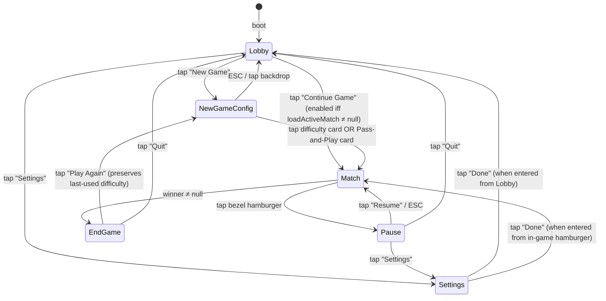
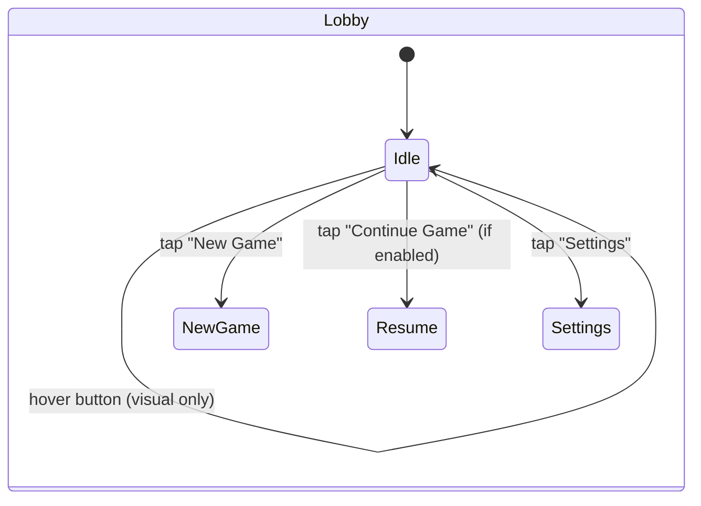
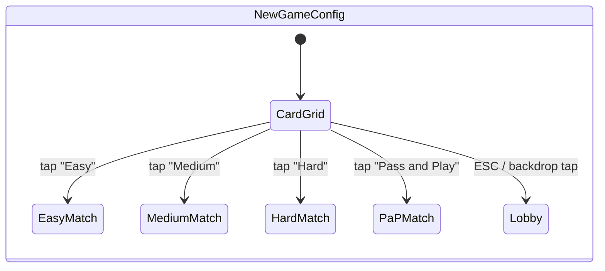
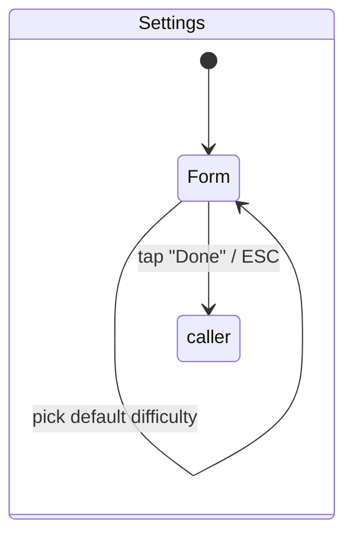
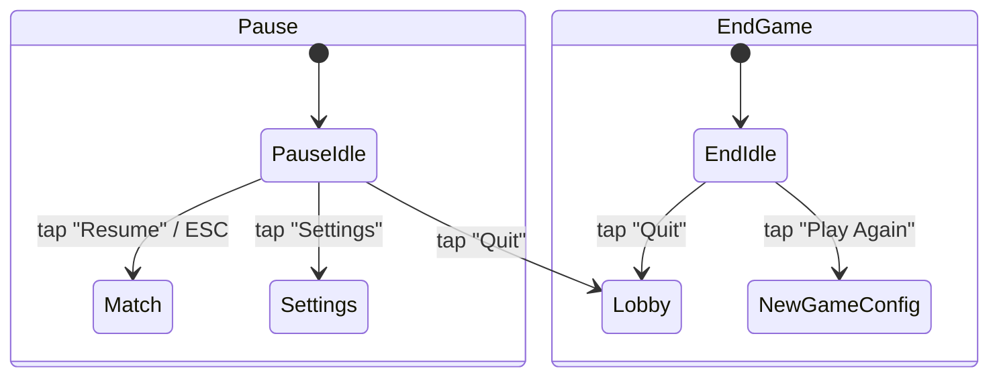
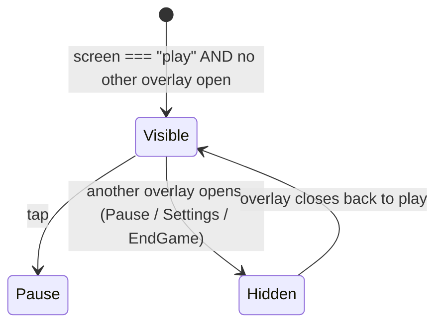

# UI flows

State diagrams for every screen + every per-turn interaction. Authoritative — when this doc disagrees with the code, the code is the bug.

The two universes:

- **Centered branded overlays** (Solid, in `app/`) own: lobby, new-game config, settings, pause, end-game. Real `<dialog>` semantics, focus traps, axe-passable.
- **Diegetic SVG overlays** (vanilla, in `src/scene/overlay/`) own: split radial (anchored to a stack). The board IS the playfield; only menus moved to centered overlays.

The Solid layer and the three.js layer share state via the `koota` world; see [ARCHITECTURE.md](./ARCHITECTURE.md).

---

## Top-level screen state machine



Notes:

- "Continue Game" is greyed (`disabled` + `aria-disabled="true"`) when `loadActiveMatch()` returns `null`. Click is a no-op.
- The Pause overlay is reachable only via the bezel hamburger affordance; no keyboard shortcut binds to it (touch-first design).
- `EndGame` doesn't auto-dismiss — the player chooses Play Again or Quit. The board stays visible behind the modal.

---

## Lobby overlay

The boot screen. Centered branded card on top of the leveled-board scene. Demo pucks may rotate idly behind it as decoration; they no longer carry SVG affordances.



Buttons (top-to-bottom):

1. **New Game** — primary action, focused on first paint.
2. **Continue Game** — secondary; greyed when `loadActiveMatch()` returns null.
3. **Settings** — tertiary; opens settings modal.

Keyboard:
- `Tab` cycles New → Continue → Settings → New.
- `Enter` / `Space` activates focused button.
- `ESC` is a no-op (lobby IS the root; nothing to escape to).

---

## New-game config overlay



The four cards (2×2 grid):

| Card | Title | Descriptor | Result |
|------|-------|------------|--------|
| Top-left | **Easy** | "Casual opponent for learning the chonking dynamics." | New match, profile pair `<rand-disposition>-easy` × 2, human plays the colour the coin flip awards them. |
| Top-right | **Medium** | "A real game. The opponent thinks two moves ahead." | Profile pair `<rand-disposition>-medium` × 2. |
| Bottom-left | **Hard** | "Punishing. The opponent thinks four moves ahead." | Profile pair `<rand-disposition>-hard` × 2. |
| Bottom-right | **Pass and Play** | "Two players, one device. Pass it across the table when the board flips." | Hotseat match (`humanColor === "both"`). No AI. |

Disposition is randomised so two consecutive Easy matches feel different. The randomisation is per-side (red and white can pick different dispositions), seeded from `crypto.getRandomValues` at match-create time only.

---

## Settings overlay

Reachable from:
- The Lobby's "Settings" button.
- The bezel hamburger affordance during gameplay (top-right corner of the bezel mesh, projected to screen-space — same surface as a hamburger menu in a normal app).



Fields (v1):

- **Audio mute** — checkbox. Persists to `kv` settings.
- **Haptics** — checkbox. Default on; persists.
- **Reduced motion** — checkbox. Default reads from `prefers-reduced-motion` media query; persists override.
- **Default difficulty** — radio group (Easy / Medium / Hard). Pre-selects the matching card next time New Game opens.

No language picker — English only at v1.

`caller` resolves to whichever screen opened Settings: Lobby returns to Lobby; in-game hamburger returns to Match (overlay is dismissed without affecting game state).

---

## Per-turn interaction (vs AI, human side)

```mermaid
stateDiagram-v2
    [*] --> AwaitInput: human's turn (state.turn === humanColor)
    AwaitInput --> SelectingPiece: tap own piece
    SelectingPiece --> AwaitInput: tap empty cell / opponent (cancel)
    SelectingPiece --> SplitRadialOpen: tap own stack of height ≥ 2
    SelectingPiece --> Committing: tap legal-move target cell
    SplitRadialOpen --> Selecting: tap slice (toggle)
    Selecting --> Selecting: tap another slice
    Selecting --> Arming: hold (no-release) for 3000ms
    Arming --> Dragging: pointermove past 8px (commit hold)
    Arming --> SelectingPiece: release before 3000ms (cancel)
    Dragging --> Committing: release on legal cell
    Dragging --> SelectingPiece: release on illegal cell (snap back)
    Committing --> AwaitPivot: applyEngineAction returns; state.turn flipped (logical)
    AwaitPivot --> AIDispatch: pivot-drag completed (board tips toward opponent)
    AIDispatch --> AwaitInput: AI commits its action; auto-tips back; state.turn === humanColor again
    AwaitInput --> EndGame: state.winner ≠ null after AI commit
```

Critical invariant: `state.turn` flips inside `applyEngineAction` (immediate, logical), but the **AI is not dispatched** until the human's pivot drag completes. Between `Committing` and `AwaitPivot → AIDispatch` the engine knows it's AI's turn but the scene blocks dispatch. This is the diegetic-UI rule's core: nothing happens automatically while the player is still touching the board.

---

## Per-turn interaction (Pass-and-Play)

```mermaid
stateDiagram-v2
    [*] --> RedAwaitInput: state.turn === "red"
    RedAwaitInput --> RedSelecting: red taps own piece
    RedSelecting --> RedCommitting: red commits (move / chonk / split-resolve)
    RedCommitting --> RedAwaitPivot: state.turn flipped to "white" (logical)
    RedAwaitPivot --> Handoff180: red pivot-drag completes
    Handoff180 --> WhiteAwaitInput: board+frame rotated 180°; white sees their orientation
    WhiteAwaitInput --> WhiteSelecting: white taps own piece
    WhiteSelecting --> WhiteCommitting: white commits
    WhiteCommitting --> WhiteAwaitPivot: state.turn flipped to "red" (logical)
    WhiteAwaitPivot --> Handoff180_back: white pivot-drag completes
    Handoff180_back --> RedAwaitInput: board+frame rotated 180° back; red sees their orientation
    RedAwaitInput --> EndGame: state.winner ≠ null
    WhiteAwaitInput --> EndGame: state.winner ≠ null
```



The 180° rotation is the entire turn-end animation — extends the existing tip-animation into a full end-over-end flip of the board + bezel + scene group. Total duration ~700ms. The next player physically picks up the device and sees their pieces near the bottom, their goal row at the top.

In PaP the broker never auto-dispatches anything. Every action arrives via `commitHumanAction` from the scene's input layer, regardless of whose colour is on turn.

---

## Pause + end-game overlays



Pause overlay opens when the bezel hamburger is tapped during play. Game state is unchanged; the overlay is a dialog over the canvas.

End-game overlay opens automatically when `state.winner` becomes non-null, AFTER the winning move's animation settles AND (for the human-on-the-losing-side case) the loss audio sting plays. The player must explicitly choose Play Again or Quit; no auto-dismiss.

---

## Bezel hamburger affordance

A small (~32px square) `<button>` element positioned in the top-right corner of the bezel mesh's screen-space projection. Updated per-frame via `camera.project()` so it tracks the bezel as the board tips/rotates. Pure DOM, not SVG-in-foreignObject — Solid component overlaid on the canvas.



The hamburger is the **only** persistent UI chrome during play. Everything else lives on the board (split radial) or in modal overlays.
